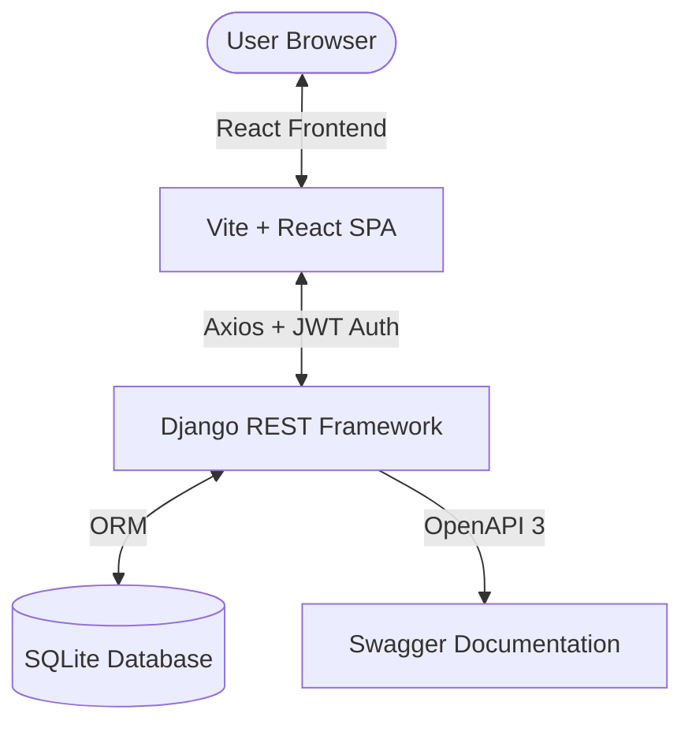

# 🚚 TransitOps: Smart Transport Operations Platform

TransitOps is a modern, full-stack fleet and transport operations management system. It provides real-time tracking, vehicle scheduling, driver dispatch, maintenance tracking, expense logging, and analytics dashboards with role-based access control.

---

## 📖 Table of Contents

- [Overview](#-overview)
- [Key Features](#-key-features)
- [Tech Stack](#-tech-stack)
- [Project Architecture](#-project-architecture)
- [Installation & Local Setup](#-installation--local-setup)
  - [Prerequisites](#prerequisites)
  - [Backend Setup](#backend-setup)
  - [Frontend Setup](#frontend-setup)
- [Seeding the Database & Demo Accounts](#-seeding-the-database--demo-accounts)
- [API Documentation](#-api-documentation)
- [Project Structure](#-project-structure)

---

## 🌟 Overview

TransitOps simplifies logistics and fleet management by unifying dispatching, vehicle maintenance, expense tracking, and driver operations into a single cohesive panel. Featuring a sleek dark-themed (and toggleable light-themed) interface with premium glassmorphic UI components, TransitOps empowers transit operators to control costs, optimize routes, and keep their fleets in peak operational health.

---

## ✨ Key Features

- **📊 Centralized Dashboard**: Real-time business metrics including total fleet cost, revenue, active trips, and charts for monthly operational breakdown.
- **🚛 Fleet Management**: Complete CRUD for vehicles, tracking registration, odometer logs, vehicle status, and load capacities.
- **👨‍✈️ Driver Roster**: Manage driver data, contact info, licenses, and availability statuses.
- **🛣️ Trip Dispatch & Tracking**: Schedule cargo runs with precise source/destination routing, cargo load limits, planned vs. actual distances, fuel consumption, and status-based workflows.
- **🔧 Maintenance Scheduling**: Logging and monitoring of vehicle maintenance tasks (e.g., oil changes, battery replacements) with cost logs, scheduled dates, and statuses.
- **💵 Expense Tracker**: Granular logs of operational costs (fuel, tolls, food, maintenance, etc.) mapped directly to vehicles or trips.
- **📈 Reports & Analytics**: Detailed visual summaries of fuel efficiency, driver performance, and financial analytics.
- **🔐 Secure Role-based Access Control (RBAC)**: JWT-authenticated dashboard displaying modules according to user roles (Admin, Fleet Manager, Dispatcher, Safety Officer, Financial Analyst).

---

## 🛠️ Tech Stack

### Backend
- **Framework**: Django 6.0+ & Django REST Framework (DRF) 3.17+
- **Authentication**: Simple JWT (JSON Web Tokens)
- **Database**: SQLite (Development) / PostgreSQL-compatible
- **API Spec & Docs**: drf-spectacular (OpenAPI 3.0 / Swagger UI)
- **Query Filtering**: django-filter

### Frontend
- **Framework**: React 18+ (Vite-powered)
- **Styling**: Vanilla CSS (Tailwind-free) custom glassmorphism design system supporting custom Dark & Light themes.
- **Icons**: Lucide React
- **Data Visualization**: Chart.js & React-Chartjs-2
- **API Client**: Axios with interceptors for token automatic refresh on `401 Unauthorized`

---

## 📂 Project Architecture



---

## ⚙️ Installation & Local Setup

### Prerequisites
- **Python**: version 3.13 or higher
- **Node.js**: LTS version (v18+)
- **Package Managers**: `uv` or `pip` (Python), and `npm` (Node)

### Backend Setup

1. **Navigate to the backend directory**:
   ```bash
   cd transitOps
   ```

2. **Set up Virtual Environment & Install Dependencies**:
   If using `uv` (recommended):
   ```bash
   uv venv
   # Activate:
   # Windows (CMD/PowerShell)
   .venv\Scripts\activate
   # macOS/Linux
   source .venv/bin/activate
   
   uv pip install -r requirements.txt
   ```
   Or using standard `pip`:
   ```bash
   python -m venv .venv
   # Activate:
   .venv\Scripts\activate
   
   pip install -r requirements.txt
   ```

3. **Run Database Migrations**:
   ```bash
   python manage.py migrate
   ```

4. **Seed Demo Data** (Optional but highly recommended, see below):
   ```bash
   python manage.py seed
   ```

5. **Start Django Server**:
   ```bash
   python manage.py runserver
   ```
   The backend server will run on `http://127.0.0.1:8000/`.

---

### Frontend Setup

1. **Navigate to the frontend directory**:
   ```bash
   cd frontend
   ```

2. **Install Node Dependencies**:
   ```bash
   npm install
   ```

3. **Start the Development Server**:
   ```bash
   npm run dev
   ```
   The frontend application will boot up at `http://localhost:5173/`.

---

## 💾 Seeding the Database & Demo Accounts

Running the command `python manage.py seed` automatically wipes existing demo data and regenerates a full sandbox environment. It generates:
- **30 Vehicles** with random operational metrics.
- **Drivers** with mocked contact data.
- **Trips, Maintenance Logs, and Expenses** to fully populate charts.
- **Test Users** for all roles.

### Available Login Credentials

You can use the following mock accounts to test the application's role-based behavior:

| Role | Email | Password |
| :--- | :--- | :--- |
| **Admin** | `admin@test.com` | `admin123` |
| **Fleet Manager** | `fleet_manager0@test.com` <br> `fleet_manager1@test.com` | `12345678` |
| **Dispatcher** | `dispatcher0@test.com` <br> `dispatcher1@test.com` | `12345678` |
| **Safety Officer** | `safety_officer0@test.com` <br> `safety_officer1@test.com` | `12345678` |
| **Financial Analyst**| `financial_analyst0@test.com` <br> `financial_analyst1@test.com` | `12345678` |

---

## 🔌 API Documentation

TransitOps generates API documentation automatically via OpenAPI v3 schemas.

Once the backend is running, you can access the interactive Swagger Documentation at:
- **Swagger UI**: [http://127.0.0.1:8000/api/docs/](http://127.0.0.1:8000/api/docs/)
- **Raw OpenAPI Schema (JSON)**: [http://127.0.0.1:8000/api/schema/](http://127.0.0.1:8000/api/schema/)

---

## 📁 Project Structure

```
TransitOPs/
├── README.md
├── requirements.txt         # Backend Python dependencies
├── pyproject.toml           # PEP 518 configuration
├── transitOps/              # Django Backend Application
│   ├── manage.py
│   ├── transitOps/          # Settings, Routing, WSGI/ASGI configurations
│   ├── accounts/            # User Custom Model & Roles
│   ├── vehicles/            # Vehicle database schema & API endpoints
│   ├── drivers/             # Driver tracking & API
│   ├── trips/               # Trip dispatch & workflow
│   ├── maintenance/         # Vehicle servicing schedules
│   ├── expenses/            # Operational costs
│   ├── dashboard/           # Metrics aggregators for the homepage
│   ├── reports/             # Aggregated analytics
│   └── common/              # Seeding CLI commands & helper modules
└── frontend/                # React Frontend Application
    ├── package.json
    ├── vite.config.js
    ├── index.html
    └── src/
        ├── App.jsx          # Router & State controller
        ├── index.css        # Core custom UI styling (supporting Light/Dark modes)
        ├── components/      # Sidebar, Navbar, and Reusable UI modules
        ├── pages/           # Dashboard, Drivers, Vehicles, Trips, etc.
        └── services/        # Axios API endpoints integration
```
